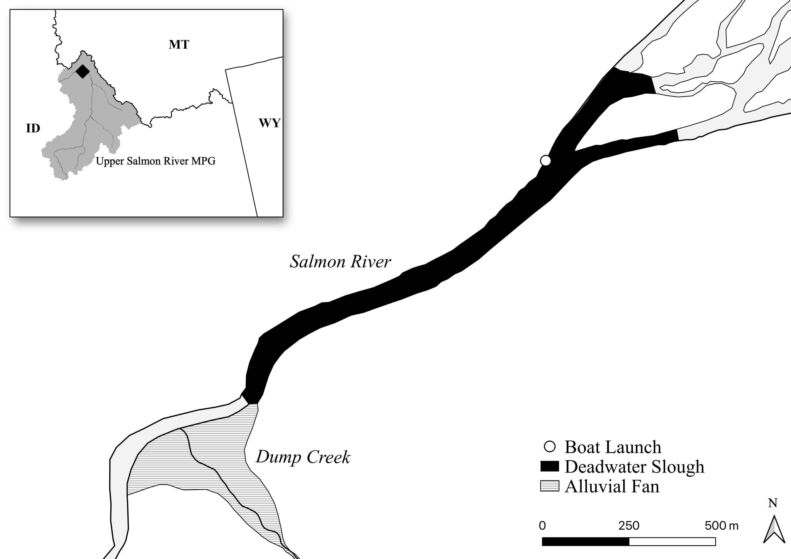

Keywords: `r rmarkdown::metadata$keywords`

```{r setup, echo = FALSE}
knitr::opts_chunk$set(
  collapse = TRUE,
  warning = FALSE,
  message = FALSE,
  echo = FALSE,
  comment = "#>",
  fig.path = "../figures/",
  dpi = 300
)

```

```{r load-libraries}
library(tidyverse)
library(magrittr)
library(janitor)
library(here)
library(lubridate)
library(FSA)
library(english)
library(lubridate)
library(tidytable)
library(kableExtra)
library(lemon)
library(gridExtra)

# format NA values in tables
options(knitr.kable.NA = '-')

# set default theme for figures
#theme_set(theme_bw())
theme_set(theme_classic())

# when knitting to Word, use this
doc.type <- knitr::opts_knit$get('rmarkdown.pandoc.to')

if(doc.type == 'docx') {
  options(knitr.table.format = "pandoc")
}

```

\newpage

## Abstract

Predation on emigrating juvenile salmonids by piscivorous fishes is a widely-studied source of mortality within reservoirs and dam tailraces in the Columbia River basin. Native Northern Pikeminnow have been estimated to consume \~8% of the approximately 200 million juvenile salmonids emigrating through the lower Snake and Columbia rivers, annually. Less is known about the interaction between upstream, river-dwelling Northern Pikeminnow and their impacts on salmonid recovery above the reservoir systems. In this study, we examine the abundance of Northern Pikeminnow in a slow-water reach of the Salmon River, Idaho, known as Deadwater Slough, and consider their potential impacts on local Chinook Salmon populations. The Deadwater Slough is within a migration corridor for several Chinook Salmon populations as well as other Endangered Species Act-listings including steelhead and Sockeye Salmon. We estimated the abundance of Northern Pikeminnow in Deadwater Slough, an approximately 1.9 kilometer reach of the Salmon River, to be 19,499 in the fall and 10,352 in the spring, corresponding with the peak emigrations of juvenile Chinook Salmon. Using these abundance values, we estimated Northern Pikeminnow consumption of juvenile Chinook Salmon. Assuming 60% of the Northern Pikeminnow diet is fish, of which 50% is juvenile Chinook Salmon, we estimated the Northern Pikeminnow population can consume 61,409 juvenile Chinook Salmon, annually. Using a sensitivity analysis, estimated Northern Pikeminnow predation on juvenile Chinook Salmon was equivalent to 377 (95% CI: 161 - 935) returning adults. Given the relatively small size of the Salmon River, the large densities and potential consumption rates of Northern Pikeminnow in Deadwater Slough suggest predation likely has consequential impact on Chinook Salmon recovery in the Upper Salmon River.

# Introduction

The Snake and Columbia rivers drain a network of inland tributaries that provide essential spawning and rearing habitat for anadromous Pacific salmon *Oncorhynchus* spp. and steelhead *O. mykiss*. These fishes were historically abundant throughout the basin and consequently have tremendous ecological, cultural, and economic value [@Atlas2021; @Lewis2019]. Over the last century, salmonid stocks throughout the Snake and Columbia rivers have undergone significant declines related to habitat modification in the freshwater environment (e.g., removal of beavers, river channel simplification, water withdrawals, hydrosystem development) and poor marine conditions, affecting their survival and recruitment at multiple life stages [@Crozier2020; @Clark2020; @Justice2017]. Consequently, action agencies have made considerable investments in the rehabilitation of tributary ecosystems and evaluation of factors attributed to the species decline [@White2021; @Roni2018].

Predation on emigrating juveniles by piscivorous fishes is another important, and potentially under-estimated, source of salmonid mortality. In the lower mainstem Snake and Columbia rivers it is estimated that predation on out-migrating salmonids during peak emigration has a significant negative impact on the overall population and success of recovery efforts [@Friesen1999; @Tabor1993; @Beamesderfer1996]. Dams and reservoirs in the Columbia River are the primary locations associated with high rates of piscine predation on salmonids [@Petersen1994; @Ward1995]. There are generally two mechanisms that explain these high predation zones. First, migration (movement) rates of juvenile salmon are reduced during reservoir passage [@Venditti2000], thereby increasing the time migrating smolts are vulnerable to predation. Second, reservoirs and downstream tailraces associated with dams on the Snake and Columbia rivers create favorable slow-water habitat for predatory fishes known to consume juvenile salmonids, such as the Northern Pikeminnow *Ptychocheilus oregonsis*. Northern Pikeminnow tolerate and thrive in relatively warm, slow-water habitats [@Wydoski2003] and consequently have benefited from dams on the Columbia River, becoming abundant predators of salmonid outmigrants [@Knutsen1999]. Northern Pikeminnow are estimated to consume \~8% (16.4 million) of the approximately 200 million juvenile salmonids emigrating through the lower Snake and Columbia Rivers, annually [@Beamesderfer1996].

```{r deadwater-attr}
# set some deadwater attributes
ddw_rkms = 1.871               # length km
ddw_m2 = 119431                # area square m
ddw_avg_width_m = 68           # measured avg width
ddw_acres = ddw_m2 / 4047
ddw_hectares = ddw_m2 / 10000

```

Most predation studies have focused on reservoirs [@Murphy2021] and mainstem reaches [@Zimmerman1999; @Tabor1993; @Ward1995; @Shively1996] of the Columbia River basin whereas considerably less is known about the interaction between upstream, river-dwelling piscivorous fishes and their impacts on salmonid recovery above the reservoir systems [@Rubenson2020]. Upstream habitats containing slower water velocities and other attributes that support piscivorous predators may overlap with essential habitat for some salmonid species and life stages. One such example is Deadwater Slough, an approximately `r round(ddw_rkms, 1)` km long reach of unnaturally slow and deep water in the Salmon River, Idaho. The Deadwater Slough is within a section of the Salmon River containing historically important overwinter rearing habitat for juvenile Chinook Salmon *O. tshawytscha* and is part of the migratory pathway for upstream Chinook Salmon, the endangered Snake River Sockeye Salmon *O. nerka* population [@Axel2015] and several populations of threatened Snake River steelhead. The slough is also inhabited by piscivorous predators, Northern Pikeminnow and Smallmouth Bass *Micropterus dolomieu*, that are potential sources of mortality for rearing and migrating salmonids.

The Salmon River was historically the most productive tributary for Chinook Salmon in the Columbia River basin [@Nemeth1999], but those populations have become depleted in recent decades. Therefore, quantifying the mortality of spring/summer-run Chinook Salmon (hereafter Chinook Salmon) in the Upper Salmon River associated with piscine predation is of particular interest. Importantly, the Salmon River supports eight extant populations of Chinook Salmon upstream of Deadwater Slough [@NOAA2017]. This includes the Lemhi River, which was historically the largest population, and is a prioritized candidate for restoration of natural processes to increase production of juvenile Chinook Salmon [@Zimmerman2012].

Chinook Salmon in the Upper Salmon River are stream-type and exhibit two distinct migration tactics; downstream rearing (DSR) and natal reach rearing (NRR) [@Copeland2014a]. The DSR migrants leave their natal area as subyearlings between June and November and typically overwinter in downstream, mainstem habitats until the following spring when they emigrate to the ocean as smolts. Alternatively, NRR migrants remain in their natal areas for approximately one year after emergence until emigration to the ocean as smolts. Diversity of migration tactics provides a mechanism for coping with adverse conditions in freshwater rearing and migration environments and buffers against catastrophic events, thereby increasing population resiliency [@Dodson2013]. Deadwater Slough represents an important habitat for Chinook Salmon in the Upper Salmon River as it supports rearing and migration of juveniles from all populations including fall DSR and spring NRR migrants.

Recent studies have examined the downstream movement, distribution, and apparent survival (hereafter 'survival') of juvenile salmonid emigrants through the Salmon River, including the Deadwater Slough reach. Sockeye Salmon migrating through the mainstem Salmon River during spring were estimated to have 32% lower survival in the Deadwater Slough reach compared to directly adjacent reaches [@Axel2015]. Similarly, emigrating DSR Chinook Salmon had an approximate 10% reduction in transition probability through the Deadwater Slough compared to surrounding reaches during fall and early winter months [@Ackerman2018; @Porter2019]. Low survival was attributed to lack of fish cover and low-velocity water delaying movement rates, thereby increasing predation risk.

In this study, we estimated the abundance of Northern Pikeminnow in the Deadwater Slough and evaluated potential impacts to juvenile salmon emigrants, focusing on DSR and NRR Chinook Salmon. We hypothesize that high densities of piscivorous predators in the Deadwater Slough may explain the reduced survival observed for juvenile Chinook Salmon. To test this, our objectives were four-fold:

1.  Estimate the abundance of Northern Pikeminnow in the Deadwater Slough during the peaks of fall DSR and spring NRR juvenile emigrations;
2.  Document predation on juvenile Chinook Salmon during the DSR and NRR emigration periods using gastric lavage;
3.  Use an established bioenergetics approach to estimate consumption potential (grams) of the Northern Pikeminnow population on DSR and NRR Chinook Salmon emigrants at Deadwater Slough;
4.  Estimate how consumption of juvenile Chinook Salmon emigrants at Deadwater Slough by Northern Pikeminnow may impact adult returns to the Upper Salmon River.

# Methods

## Study Site

The Deadwater Slough is an approximately `r round(ddw_rkms, 1)` km section of the mainstem Salmon River located roughly 6 river kilometers (rkm) downstream from the town of North Fork, Idaho (Figure \@ref(fig:map)). The downstream end of the slough is located at the confluence of Dump Creek and the Salmon River. A large alluvial fan at the mouth of Dump Creek has, at least partially, created a hydraulic control in the Salmon River resulting in the formation of Deadwater Slough. Although the origin and timing of the alluvial fan and Deadwater Slough is somewhat ambiguous [@Reichmuth1985; @USACE1986], some believe they coincided with the failure of a small mining reservoir in the Dump Creek drainage around 1897 that deposited substantial amounts of sediment at its confluence with the Salmon River [@Emerson1973]. The slough is currently a slow, deep section in the river, spanning approximately `r round(ddw_hectares)` hectares, averaging `r round(ddw_avg_width_m)` m wide, and has characteristics resembling a small reservoir.

## Northern Pikeminnow Demographics

We estimated the population size of piscine predators in the Deadwater Slough using a mark-recapture survey design and a catch per unit effort (CPUE) approach. Predators were sampled near the peaks of the fall DSR and spring NRR emigrations. During our initial survey in 2019, Northern Pikeminnow were the most prevalent piscine predator in Deadwater Slough and consequently became our focal taxa. Our intent was to survey during the emigration of the 2018 Chinook Salmon brood year that occurred fall 2019 and spring 2020, however logistical constraints during the onset of the Covid-19 pandemic delayed the spring 2020 survey until 2021. Over this period, an additional fall survey occurred during the 2020 DSR emigration. Fall surveys were constrained to two weeks to minimize Northern Pikeminnow immigration and emigration.

Multiple capture methods were employed during the fall 2019 survey to reduce selectivity and bias for species and size classes. Methods included raft electrofishing, fyke netting, snorkeling, and angling. After evaluating all methods, angling was the most effective method for capturing Northern Pikeminnow while also minimizing potential impacts to ESA-listed adult steelhead that were present during our surveys. Less effective methods were abandoned in subsequent years and the following analyses will focus on fish captured by angling, unless otherwise noted.

Our study relied heavily on volunteer anglers who were permitted to fish anywhere within Deadwater Slough. Each survey day, anglers boated or hiked their catch (periodically or upon filling a livewell) to a processing station at the boat ramp, approximately 500 m downstream from the top of the slough. For each fish, we recorded the date of capture, species, total length (TL; mm), and whether the fish was previously marked. Unmarked fish were given a physical mark (e.g., hole punch of lower caudal, upper caudal, left pelvic, right pelvic) unique to each day and then were released. Fish release sites were distributed throughout Deadwater Slough to facilitate mixing back into the population. Fish that died prior to release were included in that day's total capture (or recapture) count, but not included in the number of marked fish available for recapture after that date. Finally, we recorded the angling start and end time for each crew (person or combinations of persons) to calculate CPUE as the number of Northern Pikeminnow caught per angler hour.

```{r capture-data}
raw_df = readxl::read_excel(here("analysis/data/raw_data/Deadwater_predation_mark_recapture_11.09.21.xlsx")) %>%
  clean_names() %>%
  mutate(across(date,
                ymd)) %>%
  mutate(across(c(start_time, end_time),
                ~ ymd_hms(paste(year(date), month(date), day(date), hour(.), minute(.), second(.))))) %>%
  # break days into "sampling events"
  mutate(event_name = if_else(month(date) > 8,
                              paste("Fall", year(date), sep = "_"),
                              paste("Spring", year(date), sep = "_")))

# capture/mark/recpature data frame; focus on pikeminnow, to be used for mark-recap models
cmr_df = raw_df %>%
  filter(count > 0) %>%                                     # filter out effort-only records
  filter(species == "Northern Pikeminnow") %>%              # focus on NPM
  filter(method == "Angling") %>%
  select(event_name, 
         date,
         method, 
         species, 
         count, 
         length, 
         fish_status, 
         capture_type) %>%
  # if fish_status = Live & capture_type = Mark, set as mark_release as TRUE
  # if capture_type = Recapture, set recap to TRUE
  mutate(mark_release = if_else(fish_status == "Live" &     
                                capture_type == "Mark",
                                T, F),
         recap = if_else(capture_type == "Recapture",
                         T, F))

```

```{r effort}
# What size (mm) is considered a large pikeminnow?
large_size = 380

# catch per unit effort
cpue_df = raw_df %>%
  select(event_name,
         site,
         date,
         crew,
         crew_count,
         method,
         equipment,
         start_time:total_effort,
         total_day_effort) %>%
  distinct() %>%
  filter(method == "Angling") %>%
  mutate(across(total_effort,
                ~ . * crew_count)) %>%
  rename(total_effort_min = total_effort) %>%
  group_by(event_name,
           date) %>%
  summarise(across(c(total_effort_min,
                     crew_count),
                   sum),
            .groups = "drop") %>%
    left_join(cmr_df %>%
              group_by(event_name, species, date) %>%
              summarise(n_fish = n(),
                        n_large_fish = sum(length >= large_size,
                                           na.rm = T),
                        .groups = "drop")) %>%
  mutate(catch_per_hr = n_fish / (total_effort_min / 60),
         catch_per_angler_day = n_fish / crew_count,
         catch_lg_per_angler_day = n_large_fish / crew_count)

```

```{r lincoln-petersen-estimator}
# using Lincoln-Petersen model, combining first 4 and last four days
# define mark and recapture periods
cap_periods = tibble(event_name = "Fall_2019",
                     cap_period = "Mark",
                     int = interval(start = ymd('20191112'),
                                    end = ymd('20191114'))) %>%
  bind_rows(tibble(event_name = "Fall_2019",
                   cap_period = "Recapture",
                   int = interval(start = ymd('20191119'),
                                  end = ymd('20191121')))) %>%
  bind_rows(tibble(event_name = "Fall_2020",
                   cap_period = "Mark",
                   int = interval(start = ymd('20201020'),
                                  end = ymd('20201023')))) %>%
  bind_rows(tibble(event_name = "Fall_2020",
                   cap_period = "Recapture",
                   int = interval(start = ymd('20201027'),
                                  end = ymd('20201030'))))

# add cap_period column, fill w/ NA
cmr_df$cap_period = NA_character_
# fill cap_period w/ Mark or Recapture
for(i in 1:nrow(cap_periods)) {
  my_int = cap_periods$int[i]
  index = which(cmr_df$date %within% my_int)
  cmr_df$cap_period[index] = cap_periods$cap_period[i]
}

# Lincoln-Peterson Model
LP_mod = cmr_df %>%
  filter(event_name != "Spring_2021") %>%
  group_by(event_name, species) %>%
  summarise(M = sum(cap_period == "Mark" & fish_status == "Live", na.rm = T),
            n = sum(cap_period == "Recapture"),
            m = sum(cap_period == "Recapture" & capture_type == "Recapture", na.rm = T),
            .groups = "drop") %>%
  nest(data = -c(event_name, species)) %>%
  crossing(model = c("Petersen",
                     "Chapman")) %>%
    mutate(mr_model = map2(data,
                       model,
                      .f = function(x, y) {
                        with(x,
                             FSA::mrClosed(M = M,
                                          n = n,
                                          m = m,
                                          method = y))
                        }),
         N_summ = map(mr_model,
                      .f = summary,
                      incl.SE = T),
         CI = map(mr_model,
                  .f = confint)) %>%
    mutate(N = map_dbl(N_summ,
                     .f = function(x) x[1]),
         SE = map_dbl(N_summ,
                      .f = function(x) x[2]),
         Lci = map_dbl(CI,
                         .f = function(x) x[1]),
         Uci = map_dbl(CI,
                         .f = function(x) x[2])) %>%
    select(-N_summ, -CI)

```

```{r schnabel-estimator, eval = T}
# using Schnabel and Schumacher-Eschmeyer estimators
N_mods = cmr_df %>%
  # filter out spring 2021 (no recapture)
  filter(event_name != "Spring_2021") %>%
  group_by(event_name, species, date) %>%
  summarise(n = n(),
            m = sum(capture_type == "Recapture", na.rm = T),
            u = sum(capture_type == "Mark" | is.na(capture_type)),
            R = sum(fish_status == "Live", na.rm = T),
            .groups = "drop") %>%
  group_by(event_name, species) %>%
  mutate(M = lag(R - m),
         M = replace_na(M, 0),
         M = cumsum(M)) %>%
  nest() %>%
  crossing(model = c("Schnabel",
                     "SchumacherEschmeyer")) %>%
  mutate(mr_model = map2(data,
                         model,
                         .f = function(x, y) {
                           with(x,
                                mrClosed(n = n,
                                         m = m,
                                         R = R,
                                         method = y,
                                         chapman.mod = TRUE))
                         }),
         N = map_dbl(mr_model,
                     .f = summary),
         CI = map(mr_model,
                  .f = confint,
                  conf.level = 0.95),
         Lci = map_dbl(CI,
                       .f = function(x) x[1]), 
         Uci = map_dbl(CI,
                       .f = function(x) x[2])) %>%
  ungroup() %>%
  select(-CI)

```

```{r assump-violation}
# assume that marked fish aren't available for recapture until 48 days after release
# using Schnabel estimator
N_mods_viol = N_mods %>%
  filter(model == "Schnabel") %>%
  select(event_name:model) %>%
  mutate(data = map(data,
                    .f = function(x) {
                      x %>%
                        mutate(R_lag = lag(R),
                               R_lag = replace_na(R_lag,
                                                  0))
                    })) %>%
  mutate(mr_model = map2(data,
                         model,
                         .f = function(x, y) {
                           with(x,
                                mrClosed(n = n,
                                         m = m,
                                         R = R_lag,
                                         method = y,
                                         chapman.mod = TRUE))
                         }),
         N = map_dbl(mr_model,
                     .f = summary),
         CI = map(mr_model,
                  .f = confint),
         Lci = map_dbl(CI,
                       .f = function(x) x[1]),
         Uci = map_dbl(CI,
                       .f = function(x) x[2])) %>%
  ungroup() %>%
  select(-CI) %>%
  mutate(model = "Schnabel - Delayed Mixing")
```

```{r abund-est}
all_est = LP_mod %>%
  select(event_name, species, model, N:Uci) %>%
  bind_rows(N_mods %>%
             select(event_name, species, model, N:Uci)) %>%
  bind_rows(N_mods_viol %>%
             select(event_name, species, model, N:Uci)) %>%
  mutate(range = Uci - Lci,
         prop_range = range / N) %>%
  mutate(across(event_name,
                ~ str_replace(., "_", " "))) %>%
  mutate(model = fct_recode(model,
                            "Schumacher-Eschmeyer" = "SchumacherEschmeyer"),
         model = fct_relevel(model,
                             "Petersen",
                             after = 0)) %>%
  arrange(event_name, model) %>%
  # remove the Petersen and Schumacher-Eschmeyer estimators
  filter(! model %in% c("Petersen",
                        "Schumacher-Eschmeyer"))

```

```{r spring-abund}
total_cpue = cpue_df %>%
  mutate(across(event_name,
                ~ str_replace(., "_", " "))) %>%
  group_by(species,
           event_name) %>%
  summarise(across(c(total_effort_min,
                     n_fish,
                     n_large_fish,
                     angler_days = crew_count),
                   sum),
            .groups = "drop") %>%
  mutate(catch_per_hr = n_fish / (total_effort_min / 60),
         catch_per_angler_day = n_fish / angler_days,
         catch_lg_per_angler_day = n_large_fish / angler_days)
  
spring_abund = all_est %>%
  filter(model == "Schnabel - Delayed Mixing") %>%
  # filter(model == "Schnabel") %>%
  select(-range, -prop_range) %>%
  inner_join(total_cpue,
             by = c("event_name", "species")) %>%
  select(species,
         model,
         model_event = event_name,
         N_F = N,
         Lci_F = Lci,
         Uci_F = Uci,
         cpue_F = catch_per_hr) %>%
  group_by(species, model) %>%
  summarise(across(c(N_F:cpue_F),
                   mean),
            .groups = "drop") %>%
    full_join(total_cpue %>%
              filter(str_detect(event_name, "Spring")) %>%
              select(species,
                     cpue_S = catch_per_hr),
            by = "species") %>%
  # calculate spring abundance estimate
  mutate(N_S = N_F * (cpue_S / cpue_F),
         Lci_S = Lci_F * (cpue_S / cpue_F),
         Uci_S = Uci_F * (cpue_S / cpue_F))

```

Two types of mark-recapture estimators were used to explore variation in abundance estimates: a single census and a multiple census estimator. For the single census estimator, we treated the first week of the survey as the mark event and the following week as the recapture event, pooling data within each week. Alternatively, the multiple census estimator treated each day as a sampling event and used information about the total number of marked fish from all previous events to calculate the total abundance. For the single census estimator, we used the Chapman-modified Lincoln-Peterson estimator:

$$
\hat{N} = \frac{(M + 1)(n + 1)}{(m + 1)} - 1
$$

where $M$ is the total number of fish marked and returned to the population during the first event (week), $n$ is the total number of fish caught in the second event (week), and $m$ is the number of marked fish caught during the second week. For a multiple census estimator, we used the Chapman-modified Schnabel estimator:

$$
\hat{N} = \frac{\sum\limits_{i = 1}^k n_i M_i}{\left(\sum\limits_{i = 1}^k m_i \right) + 1}
$$

where $M$, $n$, and $m$ are indexed by each survey (day), $i$. The 95% confidence intervals of the Schnabel estimator were calculated using a Poisson approximation [@Krebs1999].<!--The Schnabel estimator is essentially the weighted average of a series of Chapman-modified Lincoln-Peterson estimators.-->

Because fish capture was dependent on volunteer anglers, there was concern that sampling effort was biased to locations preferred by anglers. If release sites for marked fish were not proximal to preferred angling locales, recently released fish may have been less susceptible to immediate capture than unmarked fish. To account for this potential bias, we included an adjusted "delayed-mixing" Schnabel estimator that assumed fish marked and released on a given survey day were not available for recapture for 48 hours. The delayed-mixing Schnabel estimator is given by:

$$
\hat{N} = \frac{\sum\limits_{i = 1}^k n_i M_{i-1}}{\left(\sum\limits_{i = 1}^k m_i \right) + 1}
$$ 

All mark-recapture abundance estimators include a Chapman correction for small sample sizes [@Chapman1951] and assumed: (1) the population is closed (no immigration, emigration, births or deaths during the survey period), (2) all fish have equal chance of being caught in subsequent survey days, (3) marking a fish does not affect its chances of recapture, (4) no loss of marks, and (5) marks are not missed or misidentified.

Surveys conducted in spring 2021 did not follow a mark-recapture study design so Northern Pikeminnow abundance was estimated as the ratio of mean total CPUE in the fall surveys to the total CPUE in the spring survey, then multiplied that ratio by the mean abundance from fall surveys.

$$
\hat{N}_{spring} = \overline{N}_{fall} * \frac{CPUE_{spring}}{CPUE_{fall}}
$$

This approach assumes equal capture probabilities for fall and spring surveys. Fall and spring population estimates were converted into linear and areal densities by dividing by the length and area of Deadwater Slough, respectively. Length and area were measured in QGIS software [@QGISDevelopmentTeam2022] and using drone-generated orthoimagery.

```{r psd}
s_size = 250        # stock size
q_size = large_size # quality size

psd_df = cmr_df %>%
  select(event_name,
         species,
         count,
         length,
         recap) %>%
  filter(recap != T)

fq = psd_df %>%
  filter(length >= q_size) %>%
  nrow()

fs = psd_df %>%
  filter(length >= s_size) %>%
  nrow()

psd = 100 * (fq/fs)

```

Anglers reported that Northern Pikeminnow in Deadwater Slough were large-bodied. To describe the population size structure, we calculated the proportional stock density (PSD) for Northern Pikeminnow in Deadwater Slough. PSD is the percentage of all fish that meet criteria for "quality-length" (larger) individuals and "stock-length" individuals:

$$
PSD = 100 * \frac{FQ}{FS}
$$

where $FQ$ is the number of fish $\ge$ quality-length, and $FS$ is the number of fish $\ge$ stock-length. For Northern Pikeminnow in Deadwater Slough, we used `r prettyNum(q_size, digits = 0)` mm TL for quality-length and `r prettyNum(s_size, digits = 0)` mm TL for stock-length [@Winther2020].

## Stomach Contents

Gastric lavage [@Foster1977] was used to examine the stomach contents of Northern Pikeminnow for the presence of juvenile Chinook Salmon and other fishes occupying Deadwater Slough. Immediately following lavage, stomach contents of individuals were preserved with 99% isopropyl alcohol in whirl-paks to be analyzed in a controlled environment. For each stomach sample, total wet weight (grams) was recorded for all stomach contents, including all fish and non-fish items (e.g., macroinvertebrates, organic matter). Fish and fish remnants were identified to the lowest taxonomic unit using diagnostic bones [@Hansel1988; @Frost2000] or were categorized as unknown. Approximately 5% of Northern Pikeminnow were euthanized for dissection (n = 75) after gastric lavage to validate the efficacy of the methodology.

```{r gastric-data}
gastric_df = raw_df %>%
  select(event_name, 
         date, 
         species,
         method,
         length,
         lavage_id,
         stomach_contents,
         stomach_contents_weight,
         fish_content_weight,
         comments) %>%
  #mutate(bin_50 = lencat(length, w = 50)) %>%
  filter(species == "Northern Pikeminnow",
         method == "Angling") %>%
  mutate(non_fish_wt = stomach_contents_weight - fish_content_weight) %>%
  mutate(lavaged = case_when(
    is.na(lavage_id) & is.na(stomach_contents) ~ FALSE,
    stomach_contents == "Did Not Lavage" ~ FALSE,
    stomach_contents == "Lost sample CG27-001" ~ FALSE,
    TRUE ~ TRUE
  )) %>%
  mutate(had_contents = case_when(
    lavaged == FALSE ~ FALSE,
    is.na(stomach_contents) ~ FALSE,
    stomach_contents == "Empty" ~ FALSE,
    TRUE ~ TRUE
  )) %>%
  mutate(had_fish_contents = case_when(
    fish_content_weight > 0 ~ TRUE,
    stomach_contents == "MacroInvert-other/Detritus/Fish-Unk" ~ TRUE,
    stomach_contents == "Fish-Unk (fish bone/cartilage)" ~ TRUE,
    stomach_contents == "MacroInvert-other/Mountain Whitefish" ~ TRUE,
    stomach_contents == "MacroInvert-other/Algae/Detritus/Fish-Unk" ~ TRUE,
    stomach_contents == "Fish -Shiner" ~ TRUE,
    stomach_contents == "Detritus/Fish-Unk" ~ TRUE,
    stomach_contents == "Fish Unk" ~ TRUE,
    stomach_contents == "Detritus/Fish -Shiner" ~ TRUE,
    stomach_contents == "MacroInvert-other/Fish-Unk" ~ TRUE,
    stomach_contents == "MacroInvert-other/Detritus/Fish -Shiner" ~ TRUE,
    stomach_contents == "Fish-Unk" ~ TRUE,
    stomach_contents == "MacroInvert-Other/Detritus/Fish-Unk" ~ TRUE,
    stomach_contents == "MacroInvert-Other/Detritus/Fish-Unk/Other"  ~ TRUE,
    stomach_contents == "Aquatic Veg/Fish-Sucker"  ~ TRUE,
    stomach_contents == "MacroInvert-Worm/Fish-RedsideShiner"  ~ TRUE,
    stomach_contents == "Aquatic Veg/Detritus/Fish-RedsideShiner"  ~ TRUE,
    stomach_contents == "MacroInvert-Other/Fish-Unk" ~ TRUE,
    stomach_contents == "Fish-Sucker/Other" ~ TRUE,
    stomach_contents == "Fish-Unk/Other" ~ TRUE,
    stomach_contents == "MacroInvert-Other/Aquatic Veg/Detritus/Fish-Sucker" ~ TRUE,
    stomach_contents == "Fish-RedsideShiner" ~ TRUE,
    stomach_contents == "Fish-Chinook/Other" ~ TRUE,
    stomach_contents == "Detritus/Fish-RedsideShiner/Other" ~ TRUE,
    stomach_contents == "MacroInvert-Other/Aquatic Veg/Detritus/Fish-RedsideShiner" ~ TRUE,
    stomach_contents == "Detritus/Fish-Sucker/Other" ~ TRUE,
    stomach_contents == "Invertebrates;FishParts"  ~ TRUE,
    stomach_contents == "Invertebrates;Detritus;FishParts;IntestinalWorms"  ~ TRUE,
    stomach_contents == "FishParts"  ~ TRUE,
    stomach_contents == "FishParts;IntestinalWorms"  ~ TRUE,
    TRUE ~ FALSE
  )) %>%
  mutate(had_chinook = case_when(
    stomach_contents == "Fish-Chinook/Other" ~ TRUE,
    TRUE ~ FALSE
  )) %>%
  mutate(across(event_name,
                ~ str_replace(., "_", " ")))

gastric_tbl = gastric_df %>%
  group_by(event_name) %>%
  summarise(captured = n(),
            lavaged = sum(lavaged),
            stmch_contents = sum(had_contents),
            fish_contents = sum(had_fish_contents)) %>%
  adorn_totals("row")

stmch_df = gastric_df %>%
  select(event_name,
         species,
         date,
         length,
         stomach_contents_weight,
         fish_content_weight,
         non_fish_wt) %>%
  filter(stomach_contents_weight > 0) %>%
  mutate(p_fish = fish_content_weight / stomach_contents_weight)

```

## Fish Consumption Potential

```{r shoup-temp-data, eval = F}
shoup_temp_df = read_tsv(here("analysis/data/raw_data/USGS_13307000_Salmon_River_Nr_Shoup.txt"),
                   comment = "#") %>%
  rename(discharge_cfs = `47768_00060`,
         discharge_cfs_cd = `47768_00060_cd`,
         gage_ht_ft = `47769_00065`,
         gage_ht_ft_cd = `47769_00065_cd`,
         water_temp_c = `47773_00010`,
         water_temp_c_cd = `47773_00010_cd`) %>%
  select(datetime, water_temp_c) %>%
  mutate(month = month(datetime),
         day = day(datetime)) %>%
  group_by(month, 
           day) %>%
  summarize(mean_water_temp = mean(water_temp_c, na.rm = T))

```

```{r length-weight}
# average size of fall and spring pikeminnow
avg_fall_NPM_TL = cmr_df %>%
  filter(grepl('Fall', event_name)) %>%
  select(length) %>%
  pull() %>%
  mean(na.rm = T)

avg_spring_NPM_TL = cmr_df %>%
  filter(grepl('Spring', event_name)) %>%
  select(length) %>%
  pull() %>%
  mean(na.rm = T)

# conversions from Fishbase.org
#TL = 1.052 * FL
#TL = 1.087 * FL (12-30cm)
#TL = 1.114 * FL (5-12cm) don't use

# use mean of coefficients
# TL = 1.0695 * FL or
# FL = 0.9350 * TL

# convert to FL
avg_fall_NPM_FL = avg_fall_NPM_TL * 0.9350
avg_spring_NPM_FL = avg_spring_NPM_TL * 0.9350

# convert FL to g using Parker (1995) equation
avg_fall_NPM_g = 10^(-4.886 + (2.986*log10(avg_fall_NPM_FL)))
avg_spring_NPM_g = 10^(-4.886 + (2.986*log10(avg_spring_NPM_FL)))

# average size of DSR and NRR juveniles
avg_DSR_g = 10.3
avg_NRR_g = 10.9

```

```{r read-bio-outputs, message=FALSE, warning=FALSE, include=FALSE}
fmt_bio_out = function(x) {
  x = x %>%
    clean_names() %>%
    mutate(date = as.Date(date, "%m/%d")) %>%
    mutate(cum_cons_fish_g = cumsum(cons_fish_g)) %>% 
    mutate(month = month(date))
  return(x)
  
}

# fall, fish 30% - 90%
fall_f30 = read_csv(here("analysis/data/raw_data/Bioenergetics_Fall_I70_F30.csv")) %>% fmt_bio_out()
fall_f40 = read_csv(here("analysis/data/raw_data/Bioenergetics_Fall_I60_F40.csv")) %>% fmt_bio_out()
fall_f50 = read_csv(here("analysis/data/raw_data/Bioenergetics_Fall_I50_F50.csv")) %>% fmt_bio_out()
fall_f60 = read_csv(here("analysis/data/raw_data/Bioenergetics_Fall_I40_F60.csv")) %>% fmt_bio_out()
fall_f70 = read_csv(here("analysis/data/raw_data/Bioenergetics_Fall_I30_F70.csv")) %>% fmt_bio_out()
fall_f80 = read_csv(here("analysis/data/raw_data/Bioenergetics_Fall_I20_F80.csv")) %>% fmt_bio_out()
fall_f90 = read_csv(here("analysis/data/raw_data/Bioenergetics_Fall_I10_F90.csv")) %>% fmt_bio_out()

# spring, fish 30% - 90%
spring_f30 = read_csv(here("analysis/data/raw_data/Bioenergetics_Spring_I70_F30.csv")) %>% fmt_bio_out()
spring_f40 = read_csv(here("analysis/data/raw_data/Bioenergetics_Spring_I60_F40.csv")) %>% fmt_bio_out()
spring_f50 = read_csv(here("analysis/data/raw_data/Bioenergetics_Spring_I50_F50.csv")) %>% fmt_bio_out()
spring_f60 = read_csv(here("analysis/data/raw_data/Bioenergetics_Spring_I40_F60.csv")) %>% fmt_bio_out()
spring_f70 = read_csv(here("analysis/data/raw_data/Bioenergetics_Spring_I30_F70.csv")) %>% fmt_bio_out()
spring_f80 = read_csv(here("analysis/data/raw_data/Bioenergetics_Spring_I20_F80.csv")) %>% fmt_bio_out()
spring_f90 = read_csv(here("analysis/data/raw_data/Bioenergetics_Spring_I10_F90.csv")) %>% fmt_bio_out()

# compile fall results
fall_results = fall_f30 %>%
  select(date, temperature_c, cum_cons_fish_g) %>%
  rename(f30_g = cum_cons_fish_g) %>%
  mutate(f40_g = fall_f40$cum_cons_fish_g,
         f50_g = fall_f50$cum_cons_fish_g,
         f60_g = fall_f60$cum_cons_fish_g,
         f70_g = fall_f70$cum_cons_fish_g,
         f80_g = fall_f80$cum_cons_fish_g,
         f90_g = fall_f90$cum_cons_fish_g) %>%
  mutate(season = "Fall") #%>%
  # mutate( across(contains('_g'),
  #                .fns = list(n = ~./avg_DSR_g),
  #                .names = "{col}_{fn}") )

# compile spring results
spring_results = spring_f30 %>%
  select(date, temperature_c, cum_cons_fish_g) %>%
  rename(f30_g = cum_cons_fish_g) %>%
  mutate(f40_g = spring_f40$cum_cons_fish_g,
         f50_g = spring_f50$cum_cons_fish_g,
         f60_g = spring_f60$cum_cons_fish_g,
         f70_g = spring_f70$cum_cons_fish_g,
         f80_g = spring_f80$cum_cons_fish_g,
         f90_g = spring_f90$cum_cons_fish_g) %>%
  mutate(season = "Spring") # %>%
  # mutate( across(contains('_g'),
  #                .fns = list(n = ~./avg_NRR_g),
  #                .names = "{col}_{fn}") )

bio_results = rbind(fall_results, spring_results)
bio_g_summ = bio_results %>%
  select(season, f30_g:f90_g) %>%
  pivot_longer(f30_g:f90_g) %>%
  group_by(season, name) %>%
  summarize(cumm_g = max(value))

rm(fall_results,
   fall_f30, 
   fall_f40, 
   fall_f50, 
   fall_f60, 
   fall_f70, 
   fall_f80, 
   fall_f90,
   spring_results,
   spring_f30, 
   spring_f40, 
   spring_f50, 
   spring_f60, 
   spring_f70, 
   spring_f80, 
   spring_f90)
```

To estimate the total consumption potential of Northern Pikeminnow in Deadwater Slough during the peaks of fall DSR and spring NRR emigrations, we used the Fish Bioenergetics v4.0 application developed by @Deslauriers2017 applied in R statistical software [@RCoreTeam2021]. The daily rate of consumption in grams for an individual Northern Pikeminnow was estimated based on predator and prey energy densities, predator start and end weights, and water temperatures. Separate models were run for the fall period (September 15 - November 30) and the spring period (March 1 - May 31) to coincide with peak emigrations of DSR and NRR juveniles from the Lemhi River, the largest Chinook Salmon population in the Upper Salmon River.

Predator energy density for Northern Pikeminnow was fixed at 6,703 Joules (J)/g [@Deslauriers2017]. Prey energy densities were fixed at 3,000 J/g for invertebrates and 21,500 J/g for juvenile Chinook Salmon [@Moss2016]. Because we were unable to differentiate juvenile Chinook Salmon from other fish prey, we assume all fish prey have the same energy densities as juvenile Chinook Salmon. The average TL of Northern Pikeminnow caught in Deadwater Slough during our study was converted to fork length (FL) and then to weight (grams) using a weight-length formula from @Parker1995.

$$
log_{10} W_s = -4.886 + 2.986[log_{10}(FL)]
$$

This resulted in average fall DSR and spring NRR starting weights of `r round(avg_fall_NPM_g, 1)` and `r round(avg_spring_NPM_g, 1)` g for Northern Pikeminnow with average TLs of `r round(avg_fall_NPM_TL, 1)` and `r round(avg_spring_NPM_TL, 1)` mm, respectively. We assumed no growth in individual Northern Pikeminnow, resulting in equal start and end weights. Mean daily water temperatures were summarized from 15-minute interval temperature readings between March 3, 2013 and June 14, 2021 from USGS gage station 13307000, approximately 22 rkm downstream of Deadwater Slough.

The proportion of fish in the Northern Pikeminnow's diet relative to non-fish prey items is unknown in Deadwater Slough. Therefore, we conducted a series of model runs with varying proportions of fish in the diet ranging from 30 - 90%, in 10% increments. These values were supported by observations elsewhere in the Columbia River basin (54-86%: @Shively1996; 48-86%: @Zimmerman1999; 37%: @Gray2001) that suggest fish are the majority of Northern Pikeminnow prey by volume. A model run was conducted for each combination of diet scenario and season, resulting in fourteen estimates of the total grams of fish consumed by an individual Northern Pikeminnow. To estimate the total biomass of fish consumed by Northern Pikeminnow in Deadwater Slough, we multiplied the grams of fish consumed by an individual Northern Pikeminnow by the estimated Northern Pikeminnow population sizes during fall and spring.

## Impacts to Chinook Salmon Populations

The proportion of Chinook Salmon prey relative to other fish prey in the Northern Pikeminnow diet is also unknown. However, there is some evidence that juvenile salmonids are by far the most consumed fish prey [@Zimmerman1999; @Shively1996]. Moreover, it is estimated that Chinook Salmon make up 64.2%, 29.3%, and 49.3% of the fish prey consumed by Northern Pikeminnow in the Columbia River below Bonneville Dam, in Columbia River reservoirs, and in the lower Snake River, respectively [@Zimmerman1999]. Because the bioenergetics model does not differentiate juvenile Chinook Salmon from other fish prey items, we performed a sensitivity analysis to assess potential impacts of Northern Pikeminnow predation on local Chinook Salmon populations. Using values similar to @Zimmerman1999, we modeled three diet scenarios where Chinook Salmon comprised 30%, 50%, and 65% of the fish prey, by weight, in the Northern Pikeminnow diet during the fall DSR and spring NRR emigration periods. In this analysis, we assume 60% of the Northern Pikeminnow's total diet is comprised of fish, representing the median scenario in our range of modeled diets.

We obtained an estimate of the number of juvenile Chinook Salmon consumed by dividing total biomass consumed by the average weight of DSR (`r avg_DSR_g` g) and NRR (`r avg_NRR_g` g) emigrants in the Upper Salmon River. The average weights of DSR and NRR emigrants were calculated from fish captured at seven rotary screw traps upstream of Deadwater Slough during the fall and spring periods. Although the primary impact to Chinook Salmon in Deadwater Slough by Northern Pikeminnow is juvenile predation, the common metric to evaluate salmon recovery is adult returns. We quantified the potential impact of Northern Pikeminnow predation on adult returns by estimating the number of equivalent adults expected to return to Lower Granite Dam if predation by Pikeminnow was eliminated in the Deadwater Slough. To accomplish this, we multiplied the estimated total juvenile Chinook Salmon consumed by the median Granite-to-Granite smolt-to-adult return rate (SAR) of 0.00614 (SD = 0.00051) from @McCann2019 for Chinook Salmon in the Upper Salmon River.

```{r adult-impacts}
# pull in SAR numbers
sar = read_csv(here("analysis/data/raw_data", 
                    "WSSCh_sar_4See.csv")) %>%
  summarise(across(c(medsar, sdsar),
                   median)) %>%
  summarise(across(c(medsar, sdsar),
               ~ . / 100))

# summarize potential Chinook eaten for each time period by one pikeminnow
impact_df = bio_results %>%
  group_by(season) %>%
  summarize(across(ends_with("_g"), max)) %>%
  pivot_longer(cols = ends_with("_g"),
               names_to = "perc_diet",
               values_to = "g_fish_cons") %>%
  mutate(across(perc_diet,
                str_extract,
                "[:digit:]+"),
         across(perc_diet,
                as.integer)) %>%
  #filter(perc_diet == 60) %>%
  crossing(p_chnk = c(.30, .50, .65)) %>%
  mutate(g_chnk = g_fish_cons * p_chnk) %>%
  mutate(n_chnk = ifelse(season == "Fall",
                         g_chnk / avg_DSR_g,
                         g_chnk / avg_NRR_g)) %>%
  left_join(spring_abund %>%
            select(N_F:Uci_F,
                   N_S:Uci_S) %>%
            pivot_longer(everything()) %>%
            mutate(season = if_else(str_detect(name, "_F$"),
                                    "Fall",
                                    "Spring")) %>%
            mutate(across(name,
                          str_remove,
                          "_F$"),
                    across(name,
                           str_remove,
                           "_S$")) %>%
            pivot_wider(names_from = name,
                        values_from = value)) %>%
  mutate(juv_N = N * n_chnk,
         juv_Lci = Lci * n_chnk,
         juv_Uci = Uci * n_chnk) %>%
  bind_cols(sar) %>%
  mutate(adult_N = juv_N * medsar,
         adult_Lci = juv_Lci * qnorm(0.025, medsar, sdsar),
         adult_Uci = juv_Uci * qnorm(0.975, medsar, sdsar))
 
# sum fall and spring impacts
total_impacts = impact_df %>%
  group_by(perc_diet, p_chnk) %>%
  summarise(across(c(ends_with("_N"),
                     ends_with("_Lci"),
                     ends_with("_Uci")),
                   sum),
            .groups = "drop") %>%
  select(perc_diet,
         p_chnk,
         juv_N,
         juv_Lci,
         juv_Uci,
         adult_N,
         adult_Lci,
         adult_Uci)

```

All data and code for the analyses presented here can be found in a GitHub repository at ***zenodo DOI***.

# Results

## Northern Pikeminnow Demographics

Using hook-and-line angling, we caught a total of `r prettyNum(sum(total_cpue$n_fish), big.mark = ",")` Northern Pikeminnow over the course of the study including `r sum(N_mods[[3]][[1]]$m) + sum(N_mods[[3]][[3]]$m)` recaptures; the overall CPUE was `r round(sum(cpue_df$n_fish) / (sum(cpue_df$total_effort_min) / 60), 2)` Northern Pikeminnow per angler hour (Table \@ref(tab:summary-tbl)). Mark-recapture abundance estimates of Northern Pikeminnow in Deadwater Slough ranged from `r prettyNum(min(all_est$N[all_est$event_name == "Fall 2019"]), big.mark = ",")` to `r prettyNum(max(all_est$N[all_est$event_name == "Fall 2019"]), big.mark = ",")` in fall 2019 and from `r prettyNum(min(all_est$N[all_est$event_name == "Fall 2020"]), big.mark = ",")` to `r prettyNum(max(all_est$N[all_est$event_name == "Fall 2020"]), big.mark = ",")` in fall 2020 (Table \@ref(tab:abund-tab)). We estimated larger populations of Northern Pikeminnow using the unadjusted multiple-census estimator compared to the single census and adjusted delayed-mixing multiple census estimators (Figure \@ref(fig:abund-fig)). Our sampling design most closely matched a multiple-census estimator; therefore, the Schnabel estimates were considered most appropriate. Accordingly, the mean Northern Pikeminnow abundance for the two fall sampling events was `r prettyNum(mean(all_est$N[all_est$model == "Schnabel"]), big.mark = ",")` (95% CI: `r prettyNum(round(mean(all_est$Lci[all_est$model == "Schnabel"])), big.mark = ",")` - `r prettyNum(round(mean(all_est$Uci[all_est$model == "Schnabel"])), big.mark = ",")`) using the unadjusted Schabel estimator. Using the delayed-mixing Schnabel estimator the mean fall abundance estimate was `r prettyNum(mean(all_est$N[all_est$model == "Schnabel - Delayed Mixing"]), big.mark = ",")` (95% CI: `r prettyNum(mean(all_est$Lci[all_est$model == "Schnabel - Delayed Mixing"]), big.mark = ",")` - `r prettyNum(mean(all_est$Uci[all_est$model == "Schnabel - Delayed Mixing"]), big.mark = ",")`). All subsequent analyses use results from the adjusted delayed-mixing Schnabel estimator. For spring 2021, we estimated `r prettyNum(round(spring_abund$N_S), big.mark = ",")` (95% CI: `r paste(prettyNum(round(c(spring_abund$Lci_S, spring_abund$Uci_S)), big.mark = ","), collapse = " - ")`) Northern Pikeminnow in Deadwater Slough. Those estimates translate to linear densities of `r prettyNum(round(mean(all_est$N[all_est$model == "Schnabel - Delayed Mixing"]) / ddw_rkms), big.mark = ",")` and `r prettyNum(round(spring_abund$N_S / ddw_rkms), big.mark = ",")` Northern Pikeminnow per rkm and areal densities (fish/100 m$^2$) of `r round((mean(all_est$N[all_est$model == "Schnabel - Delayed Mixing"]) / ddw_m2) * 100, 1)` and `r round((spring_abund$N_S / ddw_m2) * 100, 1)` for fall and spring, respectively.

The lengths of Northern Pikeminnow ranged from `r min(cmr_df$length, na.rm = T)` to `r max(cmr_df$length, na.rm = T)` mm TL with an average of `r round(mean(cmr_df$length, na.rm = T))` mm (Figure \@ref(fig:length-freq-p)). The PSD for Northern Pikeminnow in Deadwater Slough across all three surveys was `r prettyNum(psd, digits = 1)`%.

## Stomach Contents

We found that gastric lavage successfully removed food items in all dissected individuals, indicating the method was effective. Of the `r prettyNum(gastric_tbl$lavaged[gastric_tbl$event_name == "Total"], big.mark = ",")` Northern Pikeminnow sampled using gastric lavage, we found contents in `r prettyNum(gastric_tbl$stmch_contents[gastric_tbl$event_name == "Total"], big.mark = ",")` (`r prettyNum((gastric_tbl$stmch_contents[gastric_tbl$event_name == "Total"] / gastric_tbl$lavaged[gastric_tbl$event_name == "Total"]) * 100, digits = 3)`%) stomachs and confirmed fish or fish parts in `r prettyNum(gastric_tbl$fish_contents[gastric_tbl$event_name == "Total"], big.mark = ",")` of those. Northern Pikeminnow captured during spring 2021 had a higher proportion of fish content in their diet compared to individuals captured in the fall surveys (Table \@ref(tab:gastric-tab)). The mean wet weight of total contents for an individual was `r prettyNum(mean(stmch_df$stomach_contents_weight), digits = 2)` g (median = `r prettyNum(median(stmch_df$stomach_contents_weight), digits = 3)` g; SD = `r round(sd(stmch_df$stomach_contents_weight), 2)` g). Overall, fish or fish remnants made up `r prettyNum(mean(stmch_df$p_fish) * 100, digits = 3)`% of all stomach contents examined.

## Fish Consumption Potential

```{r tons-consumption}
tot_g_DSR = (bio_g_summ$cumm_g[bio_g_summ$season == "Fall" & bio_g_summ$name == "f60_g"] * mean(all_est$N[all_est$model == "Schnabel - Delayed Mixing"])) / 1000000
tot_g_NRR = (bio_g_summ$cumm_g[bio_g_summ$season == "Spring" & bio_g_summ$name == "f60_g"] * round(spring_abund$N_S)) / 1000000

```

During the fall DSR emigration, we estimated an average-size Northern Pikeminnow (`r round(avg_fall_NPM_TL, 1)` TL mm) to consume `r bio_g_summ$cumm_g[bio_g_summ$season == "Fall" & bio_g_summ$name == "f60_g"]` g of fish to maintain their body size, assuming 60% of their diet consists of fish prey (Figure \@ref(fig:bio-p)). Fall consumption ranged from `r bio_g_summ$cumm_g[bio_g_summ$season == "Fall" & bio_g_summ$name == "f30_g"]` g for a diet of 30% fish to `r bio_g_summ$cumm_g[bio_g_summ$season == "Fall" & bio_g_summ$name == "f90_g"]` g for a diet of 90% fish. During the spring NRR emigration, we estimated an average-size Northern Pikeminnow (`r round(avg_spring_NPM_TL, 1)` TL mm) to consume `r bio_g_summ$cumm_g[bio_g_summ$season == "Spring" & bio_g_summ$name == "f60_g"]` g of fish, assuming 60% of their diet is fish prey (Figure \@ref(fig:bio-p)). Spring consumption ranged from `r bio_g_summ$cumm_g[bio_g_summ$season == "Spring" & bio_g_summ$name == "f30_g"]` for a diet of 30% fish to `r bio_g_summ$cumm_g[bio_g_summ$season == "Spring" & bio_g_summ$name == "f90_g"]` for a diet of 90% fish. Daily consumption rates were higher early in the fall and late in the spring and corresponded with water temperatures above 8 degrees Celsius (Figure \@ref(fig:bio-p)). Given estimated mean Northern Pikeminnow population sizes of `r prettyNum(mean(all_est$N[all_est$model == "Schnabel - Delayed Mixing"]), big.mark = ",")` in the fall and `r prettyNum(round(spring_abund$N_S), big.mark = ",")` in the spring 2021, and a diet consisting of 60% fish, the Northern Pikeminnow population is estimated to consume `r round(tot_g_DSR, 1)` metric tons of fish during the fall DSR emigration and `r round(tot_g_NRR, 1)` metric tons during the spring NRR emigration in Deadwater Slough.

## Impacts to Chinook Salmon Populations

Given yearly fish consumption estimates during the fall DSR and spring NRR periods, we produced a sensitivity analysis to calculate the consumption of juvenile Chinook Salmon where 30%, 50%, and 65% of total fish prey consumed are juvenile Chinook Salmon (Figure \@ref(fig:juv-con-p)). At the median value of 50%, we estimated that `r prettyNum(round(total_impacts$juv_N[total_impacts$perc_diet == 60 & total_impacts$p_chnk == 0.50]), big.mark = ",")` (95% CI: `r prettyNum(round(total_impacts$juv_Lci[total_impacts$perc_diet == 60 & total_impacts$p_chnk == 0.50]), big.mark = ",")` - `r prettyNum(round(total_impacts$juv_Uci[total_impacts$perc_diet == 60 & total_impacts$p_chnk == 0.50]), big.mark = ",")`) juvenile Chinook Salmon will be consumed. Using the median Granite-to-Granite SAR for Chinook Salmon in the Upper Salmon River, we estimated the "adult equivalents" of juveniles consumed to be `r prettyNum(round(total_impacts$adult_N[total_impacts$perc_diet == 60 & total_impacts$p_chnk == 0.50]), big.mark = ",")` (95% CI: `r prettyNum(round(total_impacts$adult_Lci[total_impacts$perc_diet == 60 & total_impacts$p_chnk == 0.50]), big.mark = ",")` - `r prettyNum(round(total_impacts$adult_Uci[total_impacts$perc_diet == 60 & total_impacts$p_chnk == 0.50]), big.mark = ",")`) adults (Figure \@ref(fig:adult-imp-p)).

```{r john-day}
john_day_res_abund = 85316
john_day_rkms = 123
john_day_dens = john_day_res_abund / john_day_rkms

low_columbia_fish_km = 2814

```

# Discussion

All mark-recapture abundance estimators suggest a large population of Northern Pikeminnow occupies Deadwater Slough. The mean population size of Northern Pikeminnow was estimated to be `r prettyNum(mean(all_est$N[all_est$model == "Schnabel - Delayed Mixing"]), big.mark = ",")` during the fall DSR emigration and `r prettyNum(round(spring_abund$N_S), big.mark = ",")` during the spring NRR emigration even after accounting for the potential of delayed mixing of marked fish. Those estimates translate to linear densities (fish/rkm) that are `r round((mean(all_est$N[all_est$model == "Schnabel - Delayed Mixing"]) / ddw_rkms) / john_day_dens)` and `r round((spring_abund$N_S / ddw_rkms) / john_day_dens)` times greater than densities reported by @Beamesderfer1991 for the John Day Reservoir and approximately `r round((mean(all_est$N[all_est$model == "Schnabel - Delayed Mixing"]) / ddw_rkms) / low_columbia_fish_km)` and `r round((spring_abund$N_S / ddw_rkms) / low_columbia_fish_km)` times greater than projections for the lower Columbia River [@Beamesderfer1996]. @Beamesderfer1991 acknowledged that their methods were unsuitable for sampling offshore, noting that water velocity, depth, and irregular bottom contours, and barge traffic made sampling offshore ineffective; therefore it is possible that their estimates may have been low. Conversely, the maximum depth at Deadwater Slough was approximately 6 m with a relatively homogenous bottom contour, making angling an effective method throughout the entire reach. Our estimated densities of Northern Pikeminnow suggest that slow-water reaches outside of the reservoir complexes on the Snake and Columbia rivers may support exceptionally high predator densities, consistent with findings of @Harnish2014, @Gray2001, and @Zimmerman1999. Given the dearth of current data available throughout the Columbia River basin, it is unclear how Northern Pikeminnow abundance estimates in this study compare to elsewhere in the basin; additional information on contemporary piscine predator abundances may be needed [@Widener2021].

Several assumptions in our estimators may have influenced the magnitude of our abundance results. First, all models assumed a closed population; however, it is possible that immigration and emigration occurred. Nevertheless, our estimators still provide unbiased estimates of abundance assuming the immigration and emigration rates are equal between marked and unmarked fish. Emigration of marked individuals could reduce the marking fraction in the population leading to an upward bias in abundance estimates, but emigration rates would need to be substantial. The multiple census estimators, which we report, are more robust to this assumption because the marking fraction is estimated daily. We additionally have little reason to believe that emigration occurs during the two-week survey window owing to favorable habitat for Northern Pikeminnow in Deadwater Slough relative to adjacent reaches. Given the size of the sampling area and the short duration of our surveys, the closed population assumption is likely met. This assumption can likewise affect results if mortality occurs for some marked fish released back to the population. During field processing, no mortalities or injury post release was observed and fish injured prior to release were retained. Nevertheless, the potential for mortality amongst marked and released fish cannot be discounted.

Next, our abundance estimates assumed that capture and recapture events are random samples of the population. Angling methods often have a size selection bias, thereby limiting abundance estimates to a size range susceptible to angling, resulting in a conservative estimate of the total population. We also question the validity of our assumption of equal catchability of individual fish between sampling events. Two individual fish were recaptured during multiple days within a survey, indicating that marked fish were continually susceptible to angling. We additionally suspect that marked and released fish may not have immediately mixed thoroughly back into the population. Although we attempted to release marked fish evenly throughout Deadwater Slough, we anecdotally observed anglers congregating in particular areas of the slough to socialize or exploit "good" fishing locales. Violations of the assumption of equal catchability between marked and unmarked fish may lead to an overestimate of abundance of Northern Pikeminnow in our study if marked fish have lower catchability. This bias will be proportional to the difference in catchability of marked and unmarked fish. As an example, if marked fish were only 70% as likely to be caught as unmarked fish, the true abundance is closer to 70% of our abundance estimate. This would additionally account for marked and released fish being "hook shy" for a period of time. The adjusted delayed-mixing Schnabel estimator may account for these biases; however the magnitude of bias is unknown.

The spring abundance estimate was smaller than fall abundance estimates due to the spring CPUE being approximately half of the mean fall CPUE (Table \@ref(tab:summary-tbl)). Although our approach assumed equal capture probabilities between the fall and spring surveys, we believe that higher spring flows may result in lower capture probabilities of Northern Pikeminnow. Therefore, we believe our spring abundance estimate to be conservative.

In addition to the large population abundance, the observed (`r round(psd)`%) PSD in this study was greater than observations of 41% below Bonneville Dam and 18% in Bonneville Reservoir [@Winther2020]. This suggests that a larger fraction of Northern Pikeminnow in Deadwater Slough are of a quality size relative to populations reported elsewhere in the Columbia River. Notably, the Idaho state catch-and-release record Northern Pikeminnow, measuring `r max(gastric_df$length, na.rm = T)` mm TL, was caught in Deadwater Slough during the fall 2020 survey.

We performed gastric lavage on nearly all Northern Pikeminnow collected during this study. Observed prey species included juvenile Chinook Salmon as well as Redside Shiner *Richardsonius balteatus*, Largescale Sucker *Catostomus macrocheilus*, sculpin *Cottus* spp., and Mountain Whitefish *Prosopium williamsoni*, though decomposition from digestion rendered most fish contents unidentifiable. Although our approach provided useful information on prey species, the use of angling and gastric lavage to quantify diet composition in Northern Pikeminnow can be problematic. First, diets of angled fish can differ from those collected by other methods such as electrofishing [@Hodgson1988]. For instance, angled fish are more likely to have empty stomachs [@Jurajda2016]; possibly because they are captured while actively searching for food, suggesting they are hungry. Second, unlike other predators such as Smallmouth Bass and Walleye, that are commonly sampled using gastric lavage [@Kamler2001], Northern Pikeminnow are cyprinids and therefore lack a true stomach. Consequently, performing gastric lavage on cyprinid species can be ineffective for accurately quantifying diet composition [@Hartleb1995], or alternately, requires a modification in methodology to flush food items out the vent of the fish [@Wasowicz1994]. Therefore, we consider our diet composition estimates from gastric lavage to be conservative.

Our bioenergetics approach assumed that all available prey consumed by Northern Pikeminnow have energy densities equal to juvenile Chinook Salmon. Generalizing energy densities using a single species is a common approach [@Petersen1999]. Other salmonids including juvenile steelhead and Sockeye Salmon are likely also available prey in Deadwater Slough, especially during the spring migration, and so generalizing energy densities among salmonids may not be problematic. Additionally, hatchery smolt releases (Chinook Salmon, steelhead, and Sockeye Salmon) are also prevalent in the mainstem Salmon River during the spring migration. To address the prevalence of other fish in the Northern Pikeminnow's diet, we considered scenarios where DSR and NRR Chinook Salmon represent only 30%, 50%, and 65% of total fish prey consumed. These values may be considered conservative during the peak emigration periods when Chinook Salmon are abundant and the Northern Pikeminnow diet shifts almost entirely to piscivory, presumably on juvenile Chinook Salmon [@Shively1996; @Poe1991]. This is likely the case during fall months when DSR Chinook Salmon are the dominant prey species available the Salmon River and Deadwater Slough as 1) few to no hatchery releases are present in the river and 2) fall emigrations of steelhead and Sockeye Salmon are less prominent than Chinook Salmon. During spring when natural-origin steelhead and Sockeye Salmon are also actively emigrating from the Upper Salmon River and hatchery-origin releases of all three species (Chinook Salmon, steelhead, Sockeye Salmon) are present in the river, less than 50% Chinook Salmon in the Northern Pikeminnow's diet may be more likely. Future work to quantify and identify juvenile salmonids in Deadwater Slough during their seasonal migration would be useful to validate the diet composition assumptions used in our model and to understand impacts to local populations.

Chinook Salmon populations above Deadwater Slough are within the Upper Salmon major population group (MPG) which supports eight independent, extant populations including Salmon River (above Redfish Lake Creek), Valley Creek, Yankee Fork Salmon River, East Fork Salmon River, Salmon River (mainstem below Redfish Lake Creek), Pahsimeroi River, Lemhi River, and North Fork Salmon River [@NOAA2017]. Recovery of the MPG is desired to support local fisheries and economies. At least five of the eight populations must meet criteria set forth by @McElhany2000 and the @ICTRT2007 for the MPG to be considered viable and for recovery of the Snake River Evolutionary Significant Unit. We estimated that `r prettyNum(round(total_impacts$juv_N[total_impacts$perc_diet == 60 & total_impacts$p_chnk == 0.50]), big.mark = ",")` juvenile Chinook Salmon may be consumed by Northern Pikeminnow assuming that 60% of their diet is fish and 50% of fish prey are Chinook Salmon. For context, this is approximately `r round(total_impacts$juv_N[total_impacts$perc_diet == 60 & total_impacts$p_chnk == 0.50] / 45416, 2)` times the average annual combined DSR and NRR emigration estimates for brood years 2011 - 2018 at a rotary screw trap located in the lower Lemhi River [@McClure2021; @Feeken2020; @Poole2019], the largest population in the Upper Salmon MPG. Even under the most conservative scenario where 30% of the Northern Pikeminnow diet is fish and 30% of fish prey are Chinook Salmon, we estimate that `r prettyNum(round(total_impacts$juv_N[total_impacts$perc_diet == 30 & total_impacts$p_chnk == 0.30]), big.mark = ",")` juvenile Chinook Salmon may be consumed which is `r round((total_impacts$juv_N[total_impacts$perc_diet == 30 & total_impacts$p_chnk == 0.30] / 45416) * 100)`% of the total DSR and NRR emigration for brood years 2011 - 2018. Considering that diet scenarios used in our study are likely conservative assumptions, especially during the fall DSR emigration, the estimated number of Chinook Salmon consumed is substantial.

Spawner abundance is perhaps the most important metric considered in determining a population's viability and productivity. We estimated that consumption of juvenile Chinook Salmon by Northern Pikeminnow in the Deadwater Slough is equivalent to `r round(total_impacts$adult_N[total_impacts$perc_diet == 60 & total_impacts$p_chnk == 0.50])` adults, annually, which is `r round((total_impacts$adult_N[total_impacts$perc_diet == 60 & total_impacts$p_chnk == 0.50] / 558) * 100)`% of the total mean spawner escapement for the Upper Salmon MPG in 2017 -- 2019 [@Kinzer2020]. In the most conservative scenario, we estimated juvenile consumption equivalent to `r round(total_impacts$adult_N[total_impacts$perc_diet == 30 & total_impacts$p_chnk == 0.30])` adults, which is `r round((total_impacts$adult_N[total_impacts$perc_diet == 30 & total_impacts$p_chnk == 0.30] / 558) * 100)`% of recent natural-origin adult Chinook Salmon returns. In the least conservative scenarios, adult equivalents approached recent escapements for the entire Upper Salmon MPG. The sensitivity analysis used some simplifying assumptions; for example, it assumed no juvenile mortality between Deadwater Slough and Lower Granite Dam which is an unrealistic assumption. Nevertheless, we found converting juveniles consumed to “adult equivalents” a useful exercise to place results in context with a metric commonly used for recovery.

In additional to juvenile Chinook Salmon, juvenile steelhead and Sockeye Salmon, including both natural-origin juveniles and hatchery releases, are also likely prey items for Northern Pikeminnow in Deadwater Slough. Accordingly, we surmise that juvenile emigration and adult returns of steelhead and Sockeye Salmon are also affected by predation, including hatchery populations, which provide for recreational fishing opportunities in the Upper Salmon River. Consequently, reducing predation mortality in Deadwater Slough could potentially benefit multiple upriver natural and hatchery populations, including other ESA-listed species. Because Deadwater Slough is part of the migratory pathway for multiple species and populations of emigrating salmonids, the positive impact could be greater than individual tributary rehabilitation actions which typically benefit a single population. Predation on juveniles from any of the ESA-listed salmonid species is likely detrimental to their recovery.

Deadwater Slough is a favorable candidate for management or restoration actions to benefit local Chinook Salmon populations. Three potential management actions could reduce predation at Deadwater Slough: 1) removing or reducing the Dump Creek alluvial fan, 2) a local Northern Pikeminnow bounty program to encourage harvest in Deadwater Slough aimed at reducing the predator population size, and 3) adding structure or cover within Deadwater Slough to provide refuge for juvenile salmonids to reduce predation rates. Reducing or removing the Dump Creek alluvial fan has the benefit of restoring natural fluvial processes in the Salmon River that likely existed in the reach prior to the formation or increase in size of the alluvial fan. Restoring natural processes could reduce Northern Pikeminnow densities to levels similar to upstream and downstream reaches where higher survival and transition probabilities for juvenile salmon have been observed relative to Deadwater Slough [@Axel2015; @Ackerman2018; @Porter2019]. Managers ought also to consider the feasibility and net benefit of restoring fluvial processes relative to potential losses for recreational fishing and bird watching opportunities (<https://www.audobon.org/important-bird-areas/deadwater-slough>).

Northern Pikeminnow bounty programs have proven successful at reducing population sizes and impacts on emigrating salmonids in the Columbia River [@Winther2020]. A local Northern Pikeminnow bounty program could provide monetary incentive for sportfisherman, in addition to boosting the local economy from lost revenues. Bounty programs could be conducted year-round or seasonally to coincide with peak juvenile outmigration(s). Each approach would require continual/annual effort and harvest to suppress the population size and as such, appropriate funding would be needed to support the program. Lastly, a more passive approach could be to provide cover or structure within Deadwater Slough that provides refugia for juvenile salmonids during their emigration. Cover should be appropriately sized to provide concealment to juvenile fishes while reducing access by larger fishes like Northern Pikeminnow. Adding cover could be a cost-effective approach; however, its potential effectiveness is unclear.

Although the origins of Deadwater Slough are somewhat ambiguous [@Reichmuth1985; @USACE1986], it is likely that human activities in Dump Creek appear to have either exacerbated or contributed to its formation, and in turn, created favorable conditions for Northern Pikeminnow. Among the three surveys, our lowest population abundance estimate was greater than 10,000 Northern Pikeminnow that occupy Deadwater Slough, suggesting a remarkably high density given the size of the area. The slow water velocity and lack of cover for fish also create conditions where juvenile salmonids that are rearing in or emigrating through Deadwater Slough, including Chinook Salmon, are susceptible to predation. We estimate that, at a minimum, Northern Pikeminnow in Deadwater Slough consume greater than `r prettyNum(round(min(total_impacts$juv_Lci), -3), big.mark = ",")` juvenile Chinook Salmon (the lower endpoint of the confidence interval for the most conservative scenario); however, it is likely that this value is closer to `r prettyNum(round(total_impacts$juv_N[total_impacts$perc_diet == 60 & total_impacts$p_chnk == 0.50], -3), big.mark = ",")`, annually. The magnitude of predation by Northern Pikeminnow is equivalent to `r round((min(total_impacts$adult_N) / 558) * 100)`% and `r round((max(total_impacts$adult_N) / 558) * 100)`% of recent adult escapements. Deadwater Slough predates the ESA-listing of Chinook Salmon populations in the Upper Salmon MPG in the 1990s and is therefore unlikely to be the primary cause for the population's decline. However, predation by Northern Pikeminnow in Deadwater Slough and elsewhere should be considered among limiting factors hindering recovery efforts of ESA-listed Chinook Salmon populations in the Upper Salmon MPG.

\newpage

# Acknowledgements

The authors extend much appreciation to the many volunteers that assisted with field efforts including collaborators from the Bureau of Reclamation, Idaho Governor's Office of Species Conservation, Idaho Department of Fish and Game, and the Lemhi Regional Land Trust, among others. Special thanks to Jared Barker, Brian Hamilton, Tulley Mackey, and Chelsea Welke for their help in the field. We further appreciate the administrative support and guidance from staff at Inter-Fluve. This manuscript benefited from reviews by Sean Gibbs, Mark Roes, and Ian Courter. Funding for this study was provided by the Bureau of Reclamation, Pacific Northwest Regional Office (contract No. 140R1021F0018) with assistance from the Idaho Governor's Office of Species Conservation.

\newpage

# Literature Cited

<!-- The following line ensures the references appear here for the MS Word or HTML output files, rather than right at the end of the document (this will not work for PDF files):  -->

::: {#refs}
:::

\newpage

# Tables

::: {#tables}
:::

```{r summary-tbl}
summary_tbl = tibble(dummy = 1:4, bogus = 5:8) %>%
  kable(booktabs = T,
        caption = "Summary of Northern Pikeminnow angling survey data. Fall surveys included mark and recapture weeks for the single census estimate. Spring surveys included only a single capture week to estimate catch-per-unit-effort.") %>%
  kable_styling()

summary_tbl

```

\newpage

```{r bio-tbl}
bio_tbl = bio_g_summ %>%
  mutate(`Date Range` = season) %>%
  select(season,
         `Date Range`,
         name,
         cumm_g) %>%
  mutate(name = str_sub(name, 2, 3)) %>%
  rename(Season = season,
         `% Fish in Diet` = name,
         `g Consumed` = cumm_g) %>%
  mutate(`Date Range` = recode(`Date Range`,
                               Fall = "Sep 15 - Nov 30",
                               Spring = "Mar 1 - May 31")) %>%
  kable(booktabs = T,
        caption = "Bioenergetics model runs to estimate the grams of fish consumed during the fall DSR and spring NRR Chinook Salmon emigrations. The date ranges for each model run, the assumed proportion of fish in the diet, and the total grams of fish consumed by an individual Northern Pikeminnow to maintain its body weight for a given season are shown. Northern Pikeminnow start and end weights were 598.7 and 430.7 g for the fall and spring seasons, respectively.") %>%
  kable_styling()

bio_tbl

```

```{r abund-data-lp, eval = F}
LP_mod %>%
  select(event_name, species, data) %>%
  distinct() %>%
  select(-species) %>%
  unnest(data) %>%
  mutate(across(event_name,
                ~ str_replace(., "_", " "))) %>%
  rename(`Survey` = event_name) %>%
  kable(booktabs = T,
        format.args = list(big.mark = ","),
        caption = "Summary of Northern Pikeminnow angling survey data for the single-census mark-recapture estimator. M is the total number of fish caught in the first sample (week), marked and returned to the population; n is the total number of fish caught in the second sample (week), and m is the number of previously marked fish caught in the second week.") %>%
  kable_styling()

```

```{r abund-data-schn, eval = F}
N_mods %>%
  select(event_name, species, data) %>%
  distinct() %>%
  select(-species) %>%
  unnest(data) %>%
  mutate(across(event_name,
                ~ str_replace(., "_", " "))) %>%
  select(event_name, date, M, n, m, u, R) %>%
  rename(`Survey` = event_name,
         Date = date) %>%
  kable(booktabs = T,
        format.args = list(big.mark = ","),
        caption = "Summary of Northern Pikeminnow angling survey data for standard Schnabel estimator. M is the total number of fish caught in previous samples (days), marked and returned to the population; n is the total number of fish caught in the current sample (day); m is the number of marked fish caught in that sample; u is the number of unmarked fish caught, and R is the number of marked fish returned to the population. Dates of sampling are also provided.") %>%
  kable_styling()

```

\newpage

```{r abund-tab}
all_est %>%
  mutate(across(c(N, SE, Lci, Uci),
                ~ prettyNum(round(.), big.mark = ","))) %>%
  rowwise() %>%
  mutate(CI = paste(Lci, Uci,
                    sep = " - ")) %>%
  select(-c(species, range:prop_range),
         -Lci, -Uci) %>%
  rename(`Survey` = event_name,
         Estimator = model,
         `95% CI` = CI) %>%
         # `L CI` = Lci,
         # `U CI` = Uci) %>%
  kable(booktabs = T,
        format.args = list(big.mark = ","),
        caption = "Point estimates, standard errors, and 95% confidence intervals for each of the mark-recapture estimators and for the fall sampling efforts. Standard errors are not available for the multiple-census estimators.") %>%
  kable_styling()

```

\newpage

```{r gastric-tab}
gastric_tbl %>%
  rename(Survey = event_name,
         Captured = captured,
         Lavaged = lavaged,
         'Stomach Contents' = stmch_contents,
         'Fish Contents' = fish_contents) %>%
  kable(booktabs = T,
        format.args = list(big.mark = ","),
        caption = "Summary of gastric lavage results including counts of the total number of Northern Pikeminnow captured, gastric lavaged, individuals with stomach contents, and individuals with fish prey contents.") %>%
  kable_styling()

```

```{r adult-imp-tab, eval = F}
impact_tbl = total_impacts %>%
  select(perc_diet,
         p_chnk,
         N = juv_N,
         Lci = juv_Lci,
         Uci = juv_Uci) %>%
  mutate(p_chnk = p_chnk * 100) %>%
  rename(perc_chnk = p_chnk) %>%
  mutate(Stage = "Juveniles") %>%
  bind_rows(total_impacts %>%
              select(perc_diet,
                     p_chnk,
                     N = adult_N,
                     Lci = adult_Lci,
                     Uci = adult_Uci) %>%
              mutate(p_chnk = p_chnk * 100) %>%
              rename(perc_chnk = p_chnk) %>%
              mutate(Stage = "Adult Equivalents")) %>%
  select(Stage,
         `% Chinook` = perc_chnk,
         N,
         `95% L CI` = Lci,
         `95% U CI` = Uci) %>% 
  mutate(across(where(is.numeric), round)) %>%
  kable(booktabs = T,
        format.args = list(big.mark = ","),
        caption = "Estimates of juvenile Chinook Salmon consumed and adult equivalents for scenario where 60% of Northern Pikeminnow diet is fish, the median of scenarios evaluated. Table shows scenarios where 30%, 50%, and 65% of total fish consumed is Chinook Salmon. Estimates and 95% confidence intervals are calculated using Northern Pikeminnow abundance estimates of 27,874 (95% CI: 14,244 - 59,388) for fall and 14,799 (95% CI: 7,562 - 31,530) for spring. 'Adult equivalents' are estimated using a Lower Granite Dam smolt-to-adult rate (SAR) for upper Salmon River Chinook Salmon from McCann et al. (2019).") %>%
  kable_styling()
         
impact_tbl

```

\newpage

# Figures

::: {#figures}
:::

```{r map, out.width = "85%", fig.cap = "Map of the Deadwater Slough study area within the Upper Salmon River MPG. The Dump Creek alluvial fan is loacted at the downstream end of the study reach."}


```

\newpage

```{r abund-fig, fig.cap = "Estimated abundance of Northern Pikeminnow in Deadwater Slough from three mark-recapture estimators for the fall surveys. Error bars indicate 95% confidence intervals."}

pos = position_dodge(width=0.3)
pm_est_labels <- c("Chapman","Schnabel","Schnabel \n [Delayed-mixing]")
all_est %>%
  mutate(across(c(N, Lci, Uci),
                ~ . / 1000)) %>%
  mutate(census = case_when(grepl("Chapman", model) ~ "single",
                            grepl("Petersen", model) ~ "single",
                            grepl("Schnabel", model) ~ "multiple",
                            grepl("Schumacher-Eschmeyer", model) ~ "multiple")) %>%


  ggplot(aes(x = model,
             y = N,
             #color = model
             )) +
  geom_errorbar(aes(ymin = Lci,ymax = Uci, group=event_name), position = pos, width=0) + 
  geom_point(aes(shape = event_name), position = pos, size = 4) +
    #facet_wrap(~ event_name) +
  coord_cartesian(ylim = c(0, 80)) +
  scale_shape_manual(values = c(21, 19), name="Survey") +
  #scale_color_manual(values = c("grey35", "darkred"), name="Census type") +
  scale_x_discrete(labels=c(pm_est_labels))+
  labs(y = "Estimated Pikeminnow Abundance (x 1,000)",
       x = "Estimator") +
  #scale_size(guide = "none")+
  theme(legend.position = c(.15, .85),legend.background = element_blank(),
        legend.key.size = unit(.5, "cm"),legend.box = 'horizontal',
        axis.title.x = element_text(size = 11, color = "black"),
        axis.text.x = element_text(size = 11, color = "black"),
        axis.text.y = element_text(size = 11, color = "black"),
        strip.text.x = element_text(size = 11,color = "black"))
  #scale_color_brewer(palette = "Dark2")

```

\newpage

```{r length-freq-p, fig.cap = "Length frequency histogram of Northern Pikeminnow caught using hook-and-line angling during the study."}
length_freq_p = gastric_df %>%
  select(event_name,
         length) %>%
  mutate(season = event_name) %>%
  mutate(season = recode(season,
                         `Fall 2019` = "Fall",
                         `Fall 2020` = "Fall",
                         `Spring 2021` = "Spring"))

ggplot(length_freq_p, 
       aes(x = length, 
           fill = season)) +
  geom_histogram(breaks = seq(150, 650, by = 25),
                 col = "black",
                 alpha = 0.5) +
  scale_fill_manual(name = "Survey",
                    values = c("gray", "black"),
                    labels = c("Fall", "Spring")) +
  labs(x = "Total Length (mm)",
       y = "Number of Northern Pikeminnow") +
  theme(axis.text.x = element_text(size = 11,
                                   color = "black"),
        axis.text.y = element_text(size = 11,
                                   color = "black"),
        legend.position = c(.15, .85))

```

\newpage

```{r bio-p, fig.cap = "The cumulative fish prey consumed (g) by an individual Northern Pikeminnow during the peak Chinook Salmon emigrations for fall DSR (top left) and spring NRR  (top right) and corresponding daily mean water temperatures (bottom panels). The black line is the median Northern Pikeminnow diet scenario, consisting of 60% fish and the gray area shows the range between diet scenarios of 30% and 90% fish prey. Daily mean water temperatures were summarized from six years of data available from the Shoup gage station. "}
# spring_results$season = "Spring"
# fall_results$season = "Fall"
# bio_results = rbind(spring_results, fall_results)
bio_results$ymd = (ymd(bio_results$date))

pFish = bio_results %>%
  ggplot(aes(ymd, f60_g)) +
  geom_line(size = 1.1) +
  geom_ribbon(data = bio_results,
              aes(ymd,ymin = f30_g,
                  ymax = f90_g),
              color = "grey55",
              alpha = 0.4) +  theme_bw() +
  labs(y = "Fish consumed (g)",
       x = "", title = "") +
  facet_rep_wrap(~season,scales = "free_x",
                 repeat.tick.labels = F) +
  theme(strip.background = element_rect(color = "white",
                                        fill = "white"),
        strip.text.x = element_text(size = 12),
        axis.text.x = element_blank(),
        axis.text.y = element_text(size = 11,
                                   color = "black"),
        axis.title.y = element_text(vjust = 1,
                                    size = 12),
        panel.grid.major.x = element_blank(),
        panel.grid.major.y = element_blank(),
        panel.grid.minor.x = element_blank(),
        panel.grid.minor.y = element_blank(),
        plot.margin = unit(c(-.1, .3, -.3, .2), "cm"))

pTemp = bio_results %>%
  ggplot(aes(ymd, temperature_c)) +
  geom_line(color = "navyblue",
            size = 1.15) +
  theme_bw() +
  labs(y = expression("Water temp"*~degree*C),
       x = "Month",
       title = "") +
  facet_rep_wrap(~season,
                 scales = "free_x",
                 repeat.tick.labels = F) +
  theme(strip.background = element_rect(color = "white",
                                        fill = "white"),
        strip.text.x = element_blank(),
        axis.text.x = element_text(size = 11,
                                   color = "black"),
        axis.text.y = element_text(size = 11,
                                   color = "black"),
        axis.title.y = element_text(vjust = 0.1,
                                    size = 12),
        panel.grid.major.x = element_blank(),
        panel.grid.major.y = element_blank(),
        panel.grid.minor.x = element_blank(),
        panel.grid.minor.y = element_blank(),
        plot.margin = unit(c(-.2, .3, .1, .1), "cm"))

p_list = list(pFish, pTemp)
n_col = floor(sqrt(length(p_list)))

bio_p = do.call("grid.arrange",
                c(p_list, ncol = n_col))

```

\newpage

```{r juv-con-p, fig.cap = "Estimated number of juvenile Chinook Salmon consumed by Northern Pikeminnow from a sensitivity analysis of variable diet scenarios. The proportion of Chinook Salmon in the total fish prey consumed by Northern Pikminnow were evaluated for 30%, 50%, and 65% scenarios, similar to those reported by Zimmerman and Ward 1999 "}

juv_cons_p = impact_df %>%
  select(season,
         perc_diet,
         p_chnk,
         N = juv_N,
         Lci = juv_Lci,
         Uci = juv_Uci) %>%
  group_by(perc_diet,
           p_chnk) %>%
  summarise(across(c("N", "Lci", "Uci"),sum),
            .groups = "drop") %>%
  mutate(Stage = "Juveniles") %>%
  mutate(p_chnk = p_chnk * 100) %>%
  rename(perc_chnk = p_chnk) %>%
  ggplot(aes(x = perc_diet,
             y = N / 1000,
             group = as.factor(perc_chnk),
             color = as.factor(perc_chnk))) +
  geom_point(size = 2) +
  geom_line(size = 1.1) +
  scale_y_continuous(labels = scales::comma) +
  scale_x_continuous(breaks = seq(0, 100, by = 10)) +
  scale_color_manual(name = "Percent Chinook", 
                     values=c("lightsteelblue","steelblue3","navyblue")) +
  theme(axis.text.y = element_text(size = 11,
                                   color = "black"),
        axis.text.x = element_text(size = 11,
                                    color = "black"),
        strip.text.y = element_text(size = 11,
                                    color = "black"),
        legend.position = c(.19, .89),
        legend.background = element_blank(),
        legend.key.size = unit(.56, "cm"),
        legend.box = 'horizontal') +
  labs(y = "Juvenile Chinook Consumed (x 1,000)", 
       x = "Percent Fish in Pikeminnow Diet")

juv_cons_p  
  
```

\newpage

```{r adult-imp-p, fig.cap = "Estimated reduction in the annual number of returning adult Chinook Salmon as a result of Northern Pikeminnow predation. Error bars indicate 95% confidence intervals."}
#adult impacts
adult_imp_p = total_impacts %>%
  filter(perc_diet == 60) %>%
  select(p_chnk,
         adult_N,
         adult_Lci,
         adult_Uci) %>%
  mutate(perc_chnk = p_chnk * 100) %>%
  select(-p_chnk) %>%
  ggplot(aes(x = as.factor(perc_chnk),
             y = adult_N)) +
  geom_point(size = 3) +
  geom_errorbar(aes(ymin = adult_Lci,
                    ymax = adult_Uci),
                width = 0) +
  labs(y = "Estimated Adult Chinook",
       x = "Percent Chinook Salmon in Total Fish Consumed") +
  theme(axis.text.x = element_text(size = 11,
                                   color = "black"),
        axis.text.y = element_text(size = 11,
                                   color = "black"),
        legend.position = c(.2, .8),
        legend.box = "horizontal")

adult_imp_p

```

\newpage

### Colophon

This report was generated on `r Sys.time()` using the following computational environment and dependencies:

```{r colophon, cache = FALSE}
# which R packages and versions?
if ("devtools" %in% installed.packages()) devtools::session_info()

```

\newpage

The current Git commit details are:

```{r}
# what commit is this file at? 
if ("git2r" %in% installed.packages() & git2r::in_repository(path = ".")) git2r::repository(here::here())

```

\newpage

# Supplementary Materials

Although not formally assessed in this study, avian predators are another potential source of mortality for juvenile Chinook Salmon and other ESA-listed salmonids in the Deadwater Slough. The Deadwater Slough is recognized as an important bird watching and nesting area due to the associated upstream braided channels and riparian and backwater habitats [(Deadwater Slough - Audubon Important Bird Areas)](https://www.audubon.org/important-bird-areas/deadwater-slough#). Several piscivorous bird species have been documented using Deadwater Slough including the Common *Mergus merganser* and Hooded *Lophodytes cucullatus* mergansers, the Great Blue Heron *Ardea herodias*, the Double-crested Cormorant *Phalacrocorax auritus*, and the Belted Kingfisher *Megaceryle alcyon* [@eBird2021]. During the initial sampling effort in fall 2019, a two-person crew walked the entire reach including surrounding and upstream areas scanning for passive integrated transponder (PIT) tags that are implanted into thousands of natural- and hatchery-origin salmonids in the Upper Salmon River, annually. During that informal survey, 10 PIT tags were recovered near active bird nests and in an upstream anastomizing reach where herons and eagles are prevalent, suggesting that mortality may have been a result of avian predation. The PIT tag histories in [PTAGIS](https://www.ptagis.org/) indicate these tags were implanted into a combination of juvenile Chinook Salmon (3), Sockeye Salmon (4), and steelhead (3). Two of the Chinook Salmon and one steelhead were natural-origin, the remaining were of hatchery-origin. Avian predation contributes a major component of the total mortality for yearling Chinook Salmon in some locations in the lower Snake and Columbia rivers, particularly at hydroelectric dams and within reservoirs [@Evans2012; -@Evans2016]; however, we did not observe large colonies of piscivorous birds within the study area. Although we did observe Belted Kingfishers, mergansers, and Great Blue Herons at Deadwater Slough; Great Blue Herons were especially prevalent in the anastomizing reach immediately upriver of the slack water reach. Additionally, there is documentation of individual Double-crested Cormorants [@eBird2021] at the Deadwater Slough; however, the site is not within their breeding range, rather, it is part of a migration corridor. Given the current avian species known to occupy Deadwater Slough, it is unlikely that avian predation on juvenile salmonids is comparable to elsewhere in the Columbia River basin with large piscivorous bird colonies. Nevertheless, we hypothesize that the reservoir-like conditions and associated habitat features at the Deadwater Slough may increase the probability of avian predation on juvenile Chinook Salmon and other ESA-listed salmonids from the many piscivorous birds known to use the site. Future studies of predation would benefit from estimates from piscivorous avian predators.
